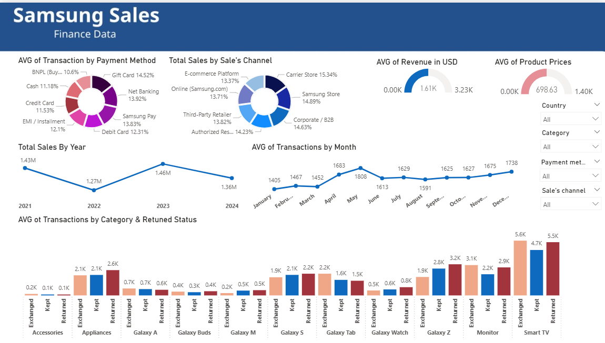
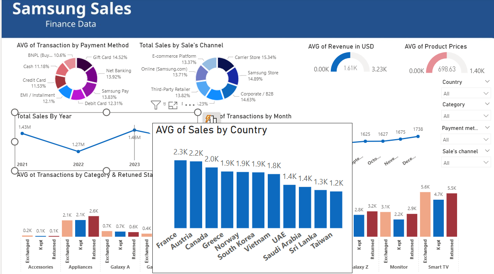
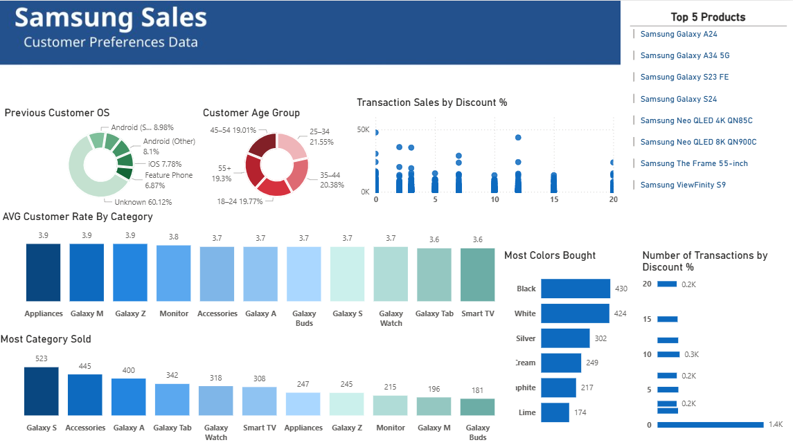

# Samsung Sales Analysis Project

 

## Introduction:
The progject concern about analyzing the sales data of Samsung company between 2021-2024, explore trends and what customers want and who intrest in Samsung products. Also, develop a prediction model using XGBOOST + RandomForest models after different tests with dashboard for explore the insights of Samsung's customers.

 

---

## Strategy of Project:

 

The project progress based on: explore the data, available tools, logic of work, test the results, then modify if needed.  
The strategy similar to search to learn and improve than create the best available models to get best results.

 

---

## Problems Occurred During the Project:

 

**The main problem happend during the develop predict model stage:**  
I tried to fit model with small features are: (category, month, year, country), but the results were bad, all models have resutls near to: -0.02 at R2 score.  
Then tried to feed model with more numeric data, so tried to adding: (category, month, year, country, day, units sold, payment method, channel of sale, and the price per unit), which made the result much better near to: 0.98 at R2 score.  
Also used at first `train_test_split` which didn't gave me better control to what I want, then tried to split them by my self that I choosed only December 2024 which didn't gave me better results (The main problem was the features), then make it more by all 2024.

 

---

## The Dashboard:

 

The dashboard consist of 2 pages, the first one for analyze finance data, and the second for customer prefrence data.  
**Insights of Finance Data:**

 

- At 2023, Samsung got the best total sales, if see why that happend will find may occured for many reasons like: Release Galaxy S23 series, enhance the support of games by improve GPU, imporving the cooling unit and battery.
- 2022 was the worest year sale of them, mainly becose release Galaxy S22 series, which hadifferent issues like poor battery and processors. Also, 2022 is year after Covid-2019 which exchange different thing such as economy factors, increase inflation, and changing the customer habits. Also, at 2022 Applie released Iphone 13 series which have strong features.
- We see that at May and December the AVG of sales increased becuase the vocations and dicount sales happend during them. On other hand, at first 3 months of year there are no increasing for sales.
- For exchange, kept, return: The accessories, Galaxy M series, and Galaxy A series are the least categories returned products which may mean customers mayn't buy them more such as Smart TV and Galaxy S.
- Smart TVs are the much product prices in Samsung.
- The AVG of product prices is 698$, and the largest around 1400$.
- The most country sales difference from year to year, France, Taiwan, Austaria, and Greece. On other hand, Saudi Arabia the least of them, may becuase the customers at it intreset more with Apple, especially at the last years ago, but now they intrest more with Andriod then last years ago.

 

**Insights of Customer Prefrence Data:**

 
- Large of customres in dataset there previous OS unknown, but in general more of them are Andriod, which mean need large effort to change people mind to change their OS.
- Most age groups are: 25-45 which can called them adults who can easily follow new technology features, about teenager may follow trands more, and for group older than 45 may want more convenient and simple OS.
- Most of sales at discount 0%, becuase this is the almost price in thte whole of year, also see at discount 12% there is more sales, which mean some people agea to find sales seasons to pay their new devices.
- Appliances, Galaxy M series, and Galaxy Z series are the most rating categories. On other hand, smart TV, Galaxy Tab series, and Galaxy watch series ar the least rate.
- Also, if see the most categories are: Galaxy S series, Galaxy tab series, and accessories which mean there is different rate range with small dataset, which can not define the main reasons for lower rates.
- Top 5 colors bought with descending order are: (black, white, silver, cream, graphite, lime) that can Samsung focus on the for future serieses with adding other brave colors.

 

**Photos of Dashboard:**

 

 
 

 
 

 

---

## The Data Used:

 

The dataset got from [Kaggle](https://www.kaggle.com/datasets/ashyou09/samsung-global-product-sales-dataset)

 

---

## The Tools Used:

 

- **Google Colab**: For EDA process, clean data, and develop and test the best models for predict future data.
- **Visual Code**: To create simple program for prediction.
- **Power BI**: For Dashboard.

 

`Note: ` The project focus on the valuable results of exploring the data and learn how to create best model for predict the result based on different features.

 

---

## Future Work:

- Use Neural Network like LSTM to get more accurate results for predictions. (need larger dataset with more numeric values)
- Can use different ML models than what used.
- Add selection filter on dashboard.
- Make more insights with more visuals. 
